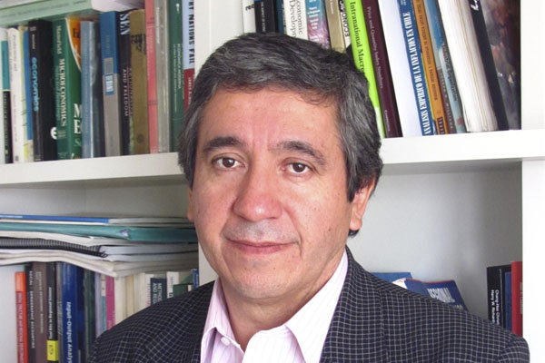

<html>

<body>

<table border="2">
<tr>

</tr>
<tr>
<td>  Research:
 </td>

<td>   Regional Economy, Conmmutation and Regional Migration, Human Capital Concentration and Input-Output Analysis    </td>

<tr>

<td>  Education:
 </td>

<td>    Ph. D., Economics, University of Illinois, Urbana-Champaign. United States, 1995. 
Postdoctoral Stage at REAL, University of Illinois, Urbana-Champaign. United States, 2002. 
</td>

</tr>

<tr>
<td>  Contact: </td>

<td> patricio.aroca@uai.cl </td>

</tr>

<tr> 
<td >    Web  </td> 
<td> https://sites.google.com/site/parocasitio1/ </td>
</tr>

<tr>
<td> 
 About:  </td>
<td> 

Professor of the Escuela de Negocios UAI, Researcher Responsible for the Nucleus of the Millennium Scientific Initiative of MIDEPLAN "Regional Science and Public Policies" and Research Professor affiliated to the Laboratory of Applied Regional Economics (REAL) of the University of Illinois, USA. He has recently published on product input analysis, spatial econometrics, regional growth and interregional labor migration. From 1997 to 2000 he was Dean of the Faculty of Economics and Administration of the Catholic University of the North and has been a consultant for the World Bank, Inter-American Development Bank (IDB), United Nations Conference for Trade and Development (UNCTAD) and the Center Latin American Demography of the United Nations (CELADE-UN). He is a member of the Comisión Chilena del Cobre (COCHILCO), and belongs to the Board of RSAI (Regional Science Association International) and PRSCO (Pacific Regional Science Council) .-
 
</td>
</tr>
</tr>

<tr>
<td>  Another afiliations  </td>
<td>  Miembro del Consejo de la Comisión Chilena del Cobre (COCHILCO)
Affiliated to the Laboratory of Applied Regional Economics (REAL) of University of Illinois, USA.
 Pacific Regional Science Organisation (PRSCO)  </td>

</tr>

</table> 

- <a href="equipo.html"> Team </a>

</body>

</html>
